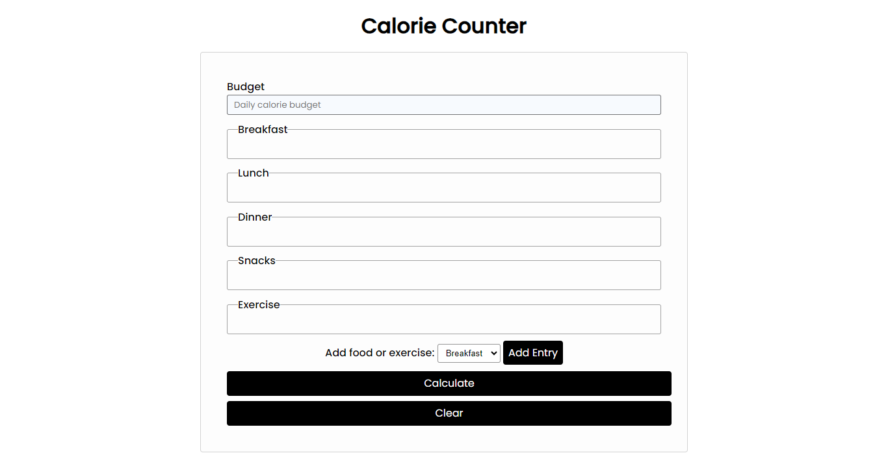

# Calorie Counter
----

A simple calorie counter project, which is part of the new freecodecamp Javascript curriculum

Currently I am learning Javacript and this project taught a lot of new concepts

----

##### Built With

- HTML
- CSS
- Javascript
- [Demo](https://calorie-counter-fcc.vercel.app/)
##### Preview

